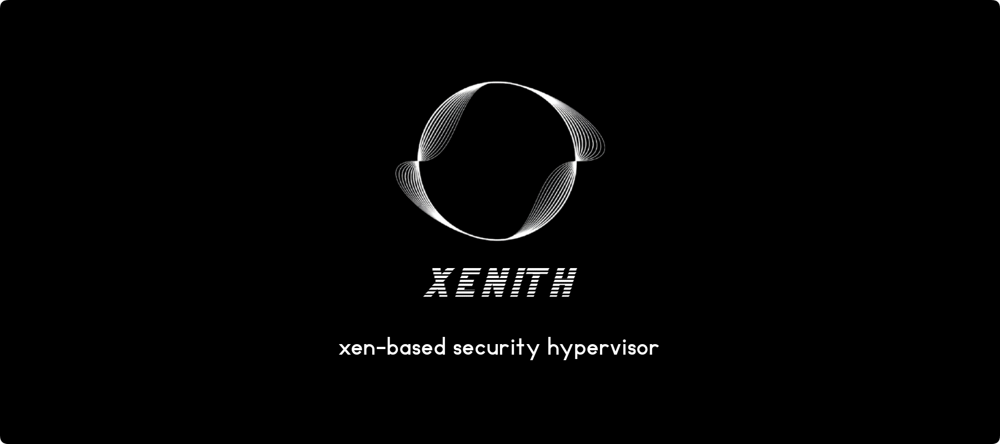

    

    <h1>Xenith</h1>
    

        Xenith is a lightweight Xen-based hypervisor designed for research and development in the realm of operating systems and virtualization. It provides a very stealth environment, advanced debugging capabilities, including low-level insights into guest systems and support for virtual machine introspection.
    

    

        Built with performance and stealth in mind, Xenith ensures minimal overhead for seamless execution of virtualized workloads. Its intuitive GUI simplifies management and monitoring, while a robust scripting API enables developers to automate tasks and extend functionality with ease.
    

    

        
        
    

## 📦 Features

- **Stealth environment**: Xenith is designed with stealth in mind. We're developing a cutting-edge anti-VM framework to ensure your virtualized workloads remain undetected. This is one of the key steps in our project roadmap.
- **Advanced debugging**: Dive deep into your systems with our comprehensive low-level debugging tools. Whether you're troubleshooting, optimizing or reverse engineering, Xenith has you covered.
- **Virtual Machine Introspection** (VMI): Get real-time insights into what's happening inside your guest VMs. This feature is invaluable for monitoring and securing your virtual environments. Hook any function, inspect memory, and more.
- **Powerful scripting API**: Automate your workflows and extend Xenith's capabilities with our robust scripting API. It's designed to be flexible and easy to use.
- **User-friendly GUI**: Debugging and reverse engineering can be complex tasks. Xenith provides a user-friendly GUI to simplify your workflow and make your life easier.
- **Snapshot and restore**: Simplify your testing process with snapshot capabilities. Capture the state of your system and revert back whenever you need to.
- **Open-source collaboration**: We believe in the power of community-driven development. Xenith is open-source, allowing everyone to contribute and innovate together.

## 🧩 Usage

See our [tutorials](https://xenith.re/docs/tutorials/) for detailed instructions on building and running Xenith.

## 📚 Documentation

You can view the full online documentation [here](https://xenith.re) or build it locally using `hugo`.

See [xenith-website](xenith-website) for more information.

## 🔗 Credits

See documentation [credits](https://xenith.re/docs/credits/).

## 📜 License

This project is licensed under the GPL-3.0 License - see the [LICENSE](LICENSE) file for details.
