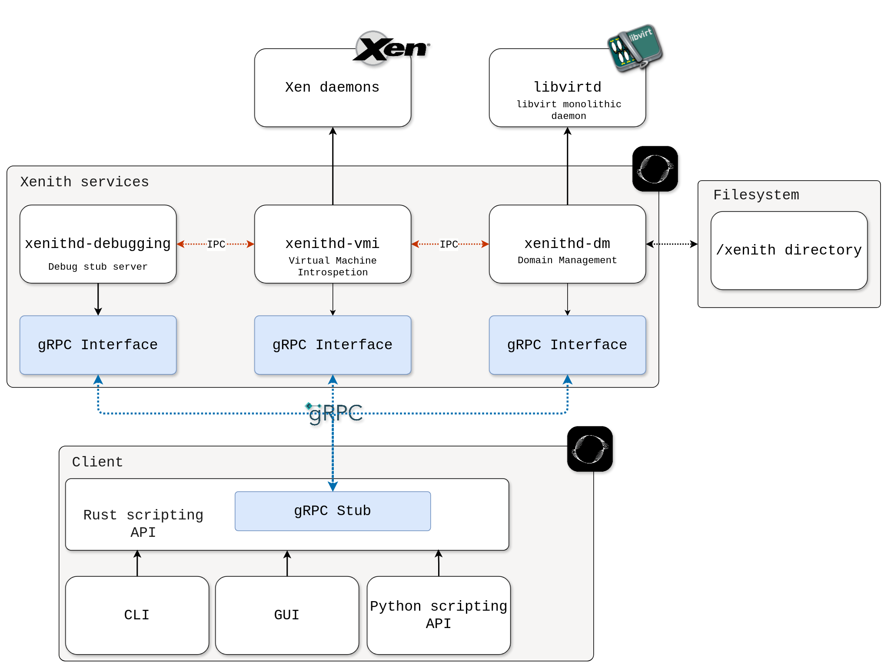

Xenith aims to be installed on a single server or workstation. Design goals are to ease the usage of provided tools and to provide a simple and clear architecture. The architecture is designed to be modular, allowing for easy integration of new tools and components.

The actual architecture is composed of several components, each with its own responsibilities. The main components are:

- `xenithd-dm`: The domain manager service, responsible for managing the lifecycle of domains and their resources through libvirt. This includes creating, starting, stopping, destroying, taking snapshots of domains, as well as managing their resources such as CPU, memory, and storage.
- `xenithd-vmi`: The virtual machine introspection (VMI) service, responsible for collecting, modifying and analyzing data from the virtual machines. This provides the core functionality of Xenith. It communicates with the Xen daemons to provide VMI capabilities.
- `xenithd-debugging`: The debugging service, responsible for providing debugging capabilities to the user. This includes the ability to set breakpoints, inspect memory, and modify the execution of the virtual machine through multiple debugging stubs.

All services expose a gRPC API, allowing for easy integration with other tools and components. Services communicate with each other through zero-copy IPC sockets, allowing for efficient data transfer and low latency.



## Domain Management

Domain management is done through the `xenithd-dm` service. This service is responsible for managing the lifecycle of domains and their resources through libvirt. The main responsibilities of this service are:

- Creating, starting, stopping, destroying, and taking snapshots of domains.
- Managing the resources of domains, such as CPU, memory, and storage.
- Managing the configuration of domains, such as network interfaces, storage devices, and other resources.
- Creating and managing disk images for domains.

This is the only service that uses the `/xenith` directory. The directory is structured as follows:

```sh
/xenith
    /images
        # Contains all cached isos with their checksums
    /domains
        /debian12-default # is the domain name
            domain.xml # libvirt configuration file
            /disks
                debian12-default.qcow2 # generated image disk
                /snapshots
                    # contains all disk snapshots
            /templates
                debian-default.pkr.hcl # packer image template
                template-variables.hcl # generated image variables

        /windows11-default
            ...
    /ansible
        # copy of project's ./ansible, to be used by packer provisioning
```

This directory does not follow classic Linux filesystem hierarchy standards for clarity and easy access purposes (it is the only exception, every other configuration files are stored in `/etc`). It is designed to be used by the `xenithd-dm` service and should not be modified manually. The directory is created when the `xenithd-dm` service is started for the first time.

## Virtual Machine Introspection

This part of documentation is to be written.

## Debugging

This part of documentation is to be written.
