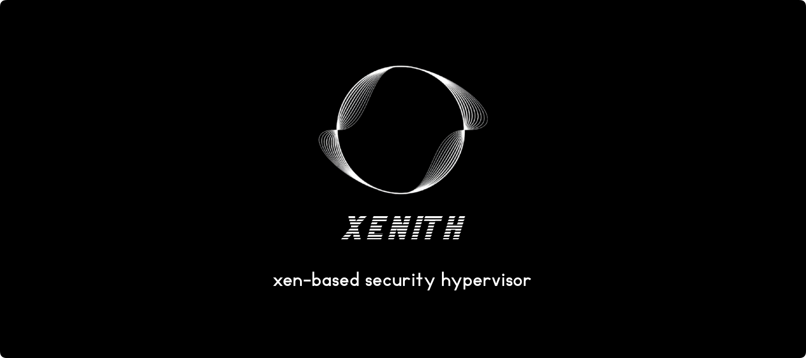

# Introduction

Welcome to Xenith, a lightweight and stealthy hypervisor built on top of [Xen](https://xenproject.org/projects/hypervisor/), designed specifically for research and development in operating systems and virtualization. Our goal is to provide a robust, yet flexible environment for developers and researchers to explore, test, and innovate.

You may now wonder, what makes Xenith special and useful ?

- **Stealth environment**: Xenith is designed with stealth in mind. We're developing a cutting-edge anti-VM framework to ensure your virtualized workloads remain undetected. This is one of the key steps in our project roadmap.
- **Advanced debugging**: Dive deep into your systems with our comprehensive low-level debugging tools. Whether you're troubleshooting, optimizing or reverse engineering, Xenith has you covered.
- **Virtual Machine Introspection** (VMI): Get real-time insights into what's happening inside your guest VMs. This feature is invaluable for monitoring and securing your virtual environments. Hook any function, inspect memory, and more.
- **Powerful scripting API**: Automate your workflows and extend Xenith's capabilities with our robust scripting API. It's designed to be flexible and easy to use.
- **User-friendly GUI**: Debugging and reverse engineering can be complex tasks. Xenith provides a user-friendly GUI to simplify your workflow and make your life easier.
- **Snapshot and restore**: Simplify your testing process with snapshot capabilities. Capture the state of your system and revert back whenever you need to.
- **Open-source collaboration**: We believe in the power of community-driven development. Xenith is open-source, allowing everyone to contribute and innovate together.

If you want to learn more about Xenith, check the [documentation organization](documentation.md) and start exploring the project.

## Community

Xenith wish to be a community-driven project. We welcome contributions from everyone, whether you're a developer, researcher, or enthusiast. Join our [Discord server](https://discord.gg/ABBtPA8exa) to share your ideas, ask questions, and collaborate with others.

## Contributing

Xenith is free and open source. You can find the source code on GitHub and issues and feature requests can be posted on the [GitHub issue tracker](https://github.com/theo-abel/xenith/issues).
If you'd like to contribute to fix bugs and add feature, please read the [contributing guide](https://theo-abel.github.io/xenith/development/contributing.html) and consider opening a [pull request](https://github.com/theo-abel/xenith/pulls).

## License

The Xenith source and documentation are released under the [GPL-3.0 license](https://www.gnu.org/licenses/gpl-3.0.en.html).
